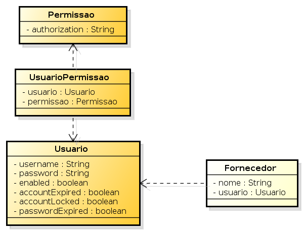

= Spring Security com Grails
Henrique Lobo Weissmann <kico@itexto.com.br>
:doctype: book
:revnumber: 1.0
:revdate: 3/4/2016
:revremark: Primeira edição
:description: Spring Security com Grails
:front-cover-image: 
:toc:
:toc-title: Índice
:footer: itexto Consultoria - http://www.itexto.com.br

:homepage: http://www.itexto.com.br

== Sobre este guia

Uma das principais dificuldades envolvendo a segurança de sistemas é o controle de acesso aos mesmos: *quem* pode acessar nossos sistemas e *o quê* pode fazer uma vez que lhe tenhamos concedido acesso?

Estas são as duas perguntas fundamentais cuja resposta é buscada por todos os frameworks/bibliotecas de segurança. Este guia rápido é voltado para desenvolvedores Grails que desejem tirar máximo proveito do plug-in Spring Security.

Apesar de ser focado em Grails, muito do que tratamos aqui poderá também ser aplicado em projetos Java baseados em Spring Framework que também usem o Spring Security.

Neste guia iremos usar a versão 3.1.4 do Grails, mas sua aplicação é práticamente a mesma nas versões 3.0.x e 2.x.

Abordaremos apenas conteúdo relacionado ao plug-in Spring Security Core em sua versão 3.0.4 (http://grails-plugins.github.io/grails-spring-security-core/), mas tal como mencionado no parágrafo anteriores, grande parte do conteúdo que iremos lecionar neste guia também se aplica à antiga versão 2.x, usada por aplicações baseadas em Grails 2.x.

É importante salientar que este é um texto básico: veja-o como um pontapé inicial para aqueles que desejam usar rápidamente esta biblioteca.

== Sobre a itexto

image::images/itexto.png[align="center", width="100px"]

Somos uma consultoria focada no desenvolvimento de software sediada em Belo Horizonte. Desenvolvemos sistemas de altíssima qualidade e ajudamos nossos clientes na execução desta tarefa através da nossa consultoria.

Atualmente nas seguintes frentes:

Treinamentos para empresas:: Ajudamos a sua empresa a dominar as tecnologias nas quais somos referência como, por exemplo, Groovy, Grails, Spring, Java EE
Treinamentos para desenvolvedores independentes:: Através da http://formacao.itexto.com.br[Formação itexto] oferecemos treinamentos voltados para desenvolvedores independentes nas tecnologias que dominamos.
Consultoria:: Projeto e crítica arquitetural, suporte a equipes de desenvolvimento e auxílio de aquisição
Desenvolvimento de sistemas customizados:: Atuamos no projeto, construção e implantação de soluções customizadas para nossos clientes
Evolução de sistemas legados:: Extraímos máximo valor da infraestrutura que nossos clientes já possuem

Atuamos em projetos tanto no Brasil quanto no exterior nas mais variadas áreas: financeira, comércio eletrônico, mineração, saúde, startups, produtos alimentícios, engenharia, tecnologia da informação, educação e pesquisa.

Além disto também atuamos junto com a comunidade de desenvolvimento de software a partir de algumas das nossas iniciativas:

http://www.groovybrasil.com.br[Groovy & Grails Brasil]:: uma das maiores comunidades do mundo de desenvolvedores que usam a linguagem Groovy e tecnologias relacionadas.
http://devall.com.br[/dev/All]:: nosso agragador de blogs de desenvolvedores
http://devkico.itexto.com.br[/dev/Kico]:: blog do nosso co-fundador, Henrique Lobo Weissmann (autor deste guia), que é considerado uma das principais referências sobre Groovy & Grails no Brasil
http://formacao.itexto.com.br[Formação itexto]:: aonde ministramos nossos treinamentos para desenvolvedores independentes nas tecnologias em que somos referência

Você pode entrar em contato conosco através do nosso site (http://www.itexto.com.br), telefone (31 2555-1979) ou e-mail (administrativo@itexto.com.br).

<<<<

== Conceitos fundamentais

No decorrer deste documento iremos usar alguns termos cujo entendimento é essencial para o bom aproveitamento do que ensinaremos aqui. Sendo assim, é importante que você *não pule* esta seção. Faremos o possível para que a experiẽncia seja o menos fatigante possível, ok?

Tal como mencionado na introdução deste guia, duas perguntas norteiam e motivam a criação do Spring Framework:

* *Quem* pode acessar o nosso sistema?
* O *quê* os usuários tem acesso no sistema?

=== Autenticação - o "quem"

O processo de autenticação é o momento no qual o usuário nos fornece suas *credenciais* que serão validados pelo sistema.

Credenciais nada mais são que informações cuja principal função é identificar o usuário, ou seja, comprovar que ele é quem diz ser. Podem se manifestar sob as mais variadas maneiras: login e senha, informações biométricas, contas em redes sociais como Facebook e Twiiter, etc.

O processo de autenticação, portanto, é composto dos passos abaixo:

* Usuário nos fornece suas credenciais
* O sistema valida estas credenciais e nos diz se são ou não válidas.

A validação de credenciais pode ser realizada nas mais variadas fontes. Neste guia iremos ver como é feita contra uma base de dados relacional, mas também pode ocorrer checando-se as informações em serviços de diretórios como LDAP, Active Directory ou mesmo interfaces REST e SOAP.

Validadas as credenciais, dizemos que o usuário se encontra "autenticado".

=== Autorização - o "quê" podemos fazer

Uma vez autenticado, o sistema deve fornecer a lista de ações que aquele usuário pode realizar no sistema. Esta lista de ações pode se manifestar das mais variadas formas, no caso do Spring Security, as chamamos de "roles" (papéis).

É importante mencionar que a autorização não diz respeito apenas a usuários que tenham sido autenticados com sucesso: ela também é a responsável por definir o que usuários que não tenham passado pelo processo de autenticação podem ou não ver em nossos sistemas.

=== "Principal"

É o usuário que atualmente está acessando o sistema (autenticado ou não). Não há muito o que ser dito sobre este conceito, mas é importante mencioná-lo aqui pois será muito usado mais à frente neste texto e costuma ser a fonte de diversas das dúvidas que vejo nos alunos que treinamos em nossos treinamentos da itexto.

== Nossa aplicação de exemplo

Iremos escrever um cadastro de fornecedor extremamente espartano: nossos usuários irão fornecer apenas seu nome e quem foi o responsável pela inclusão do registro no banco de dados.

Nossas autorizações para este sistema também serão demasiadamente simples: iremos controlar apenas quem pode alterar, inserir, excluir e visualizar registros no banco de dados.

No diagrama a seguir podemos ver todas as classes de domínio deste sistema: as classes em laranja serão usadas pelo Spring Security, conforme veremos mais a frente neste guia.

Haverá um único controlador em nosso projeto, responsável pelo cadastro de fornecedores e que será gerado pelo *scaffolding* padrão do Grails.
